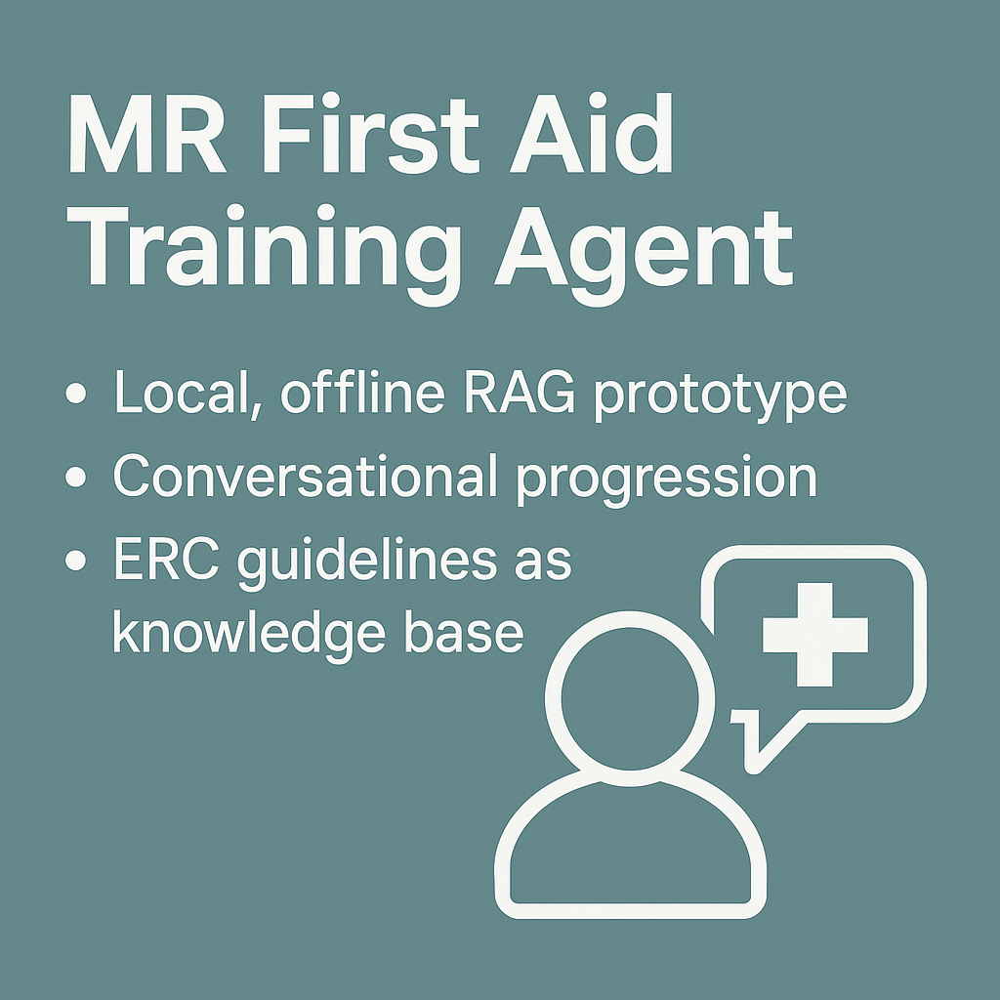

# MR First Aid Training Agent

🚑 **Project Idea**  
This project aims to build a **local, offline intelligent training agent** for **First Aid and resuscitation**.  
The long-term vision is an **interactive Mixed Reality (MR) environment** (Quest 3, multi-user) where trainees practice according to the **ERC (European Resuscitation Council) guidelines**.  
A pedagogical agent, powered by **RAG (Retrieval-Augmented Generation)** and **Agentic RAG**, will guide users step by step through resuscitation and adapt to their actions in real time.

---

## 🌍 Vision

1. **Local & Offline**  
   - Runs entirely on local hardware (MacBook M1 Pro, later Meta Quest 3).  
   - No cloud services → private, portable, and resilient.  

2. **Pedagogical Agent**  
   - Trainees can ask: *“What should I do next?”*  
   - The agent answers based on ERC guidelines and tracks progression (ambulance called, CPR started, AED used…).  
   - Later: integrates physiological parameters from a **resuscitation dummy** (blood pressure, compression depth, O₂ saturation) for adaptive feedback.  

3. **Agentic RAG**  
   - Beyond retrieval: the agent will **decide how to react**, evaluate context, and provide next-step instructions.  
   - Different configurations (chunking, data formatting, model size) will be tested for clarity and effectiveness.  

---

## 🛠️ Development Phases

**Phase 1 – Local RAG baseline (current)**  
- Run a simple offline RAG system on Mac M1 Pro.  
- ERC guidelines as knowledge base.  
- Local LLM only (e.g., Qwen GGUF via `llama-cpp-python`).  
- Conversational CLI with progression tracking.  

**Phase 2 – Graph-based progression**  
- Model the resuscitation process with LangGraph or custom state machine.  
- Natural language actions update progression state.  

**Phase 3 – Agentic RAG evaluation**  
- Tune ERC text (cleaning, chunking).  
- Test small local LLMs for instruction quality.  
- Benchmark clarity and correctness.  

**Phase 4 – Standalone Quest 3 deployment**  
- Fully local execution on-device.  
- Voice input and agent speech output in MR.  

**Phase 5 – DummyStation integration**  
- Stream real-time parameters from a resuscitation dummy.  
- Agent adapts dynamically (e.g., compression depth too shallow → corrective feedback).  

---

## ⚠️ Disclaimer

This project is **for training and research purposes only**.  
It does **not replace certified medical training** or real emergency protocols.  
Always follow official ERC guidelines and seek certified instruction.  

### Legal Notice
This project uses **paraphrased and simplified summaries** inspired by the recommendations of the **European Resuscitation Council (ERC)**.  
It does **not include or redistribute official ERC guideline texts**.  
For authoritative and up-to-date information, consult the official ERC publications at [https://erc.edu](https://erc.edu).

---

📦 Third-Party Licenses
This project depends on several open-source libraries (MIT, Apache-2.0, BSD-3-Clause, PSF).  
For details, see [THIRD_PARTY_LICENSES.md](./THIRD_PARTY_LICENSES.md).